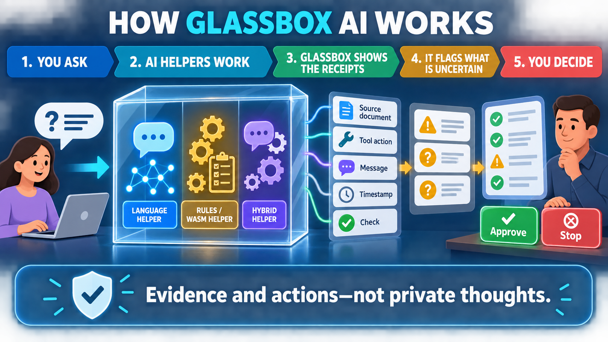
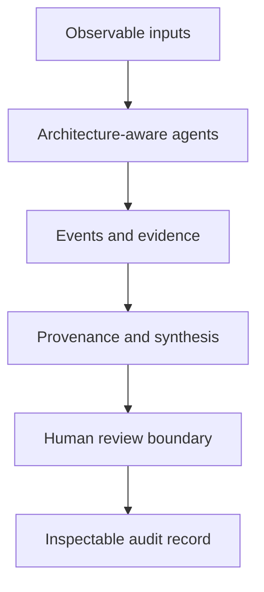
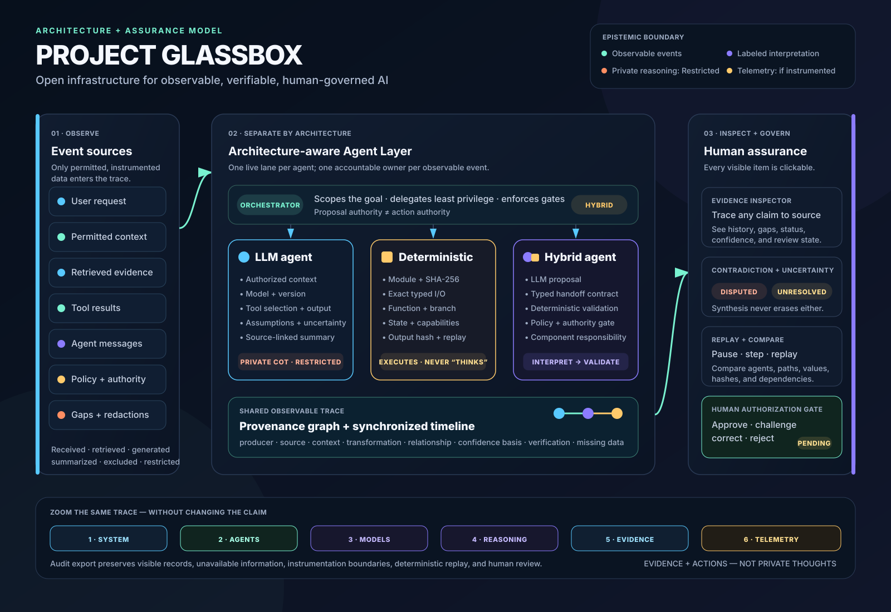

# Project Glassbox

**Open infrastructure for observable, verifiable, human-governed AI.**

[](LICENSE)
[](ROADMAP.md)
[](https://github.com/leonidas-esquire/project-glassbox/actions/workflows/ci.yml)
[](DCO.md)



Project Glassbox is an open-source interface and provenance model for seeing **what an AI system received, retrieved, generated, called, executed, and handed to a human**—without pretending to reveal private thoughts.

> AI systems should not merely give us answers. They should give us inspectable evidence, bounded actions, visible uncertainty, and a meaningful chance to intervene.

## Why this matters

Modern AI systems increasingly act through multiple models, tools, agents, memories, policy gates, and deterministic runtimes. A polished final answer can hide the questions people most need answered:

- Which evidence actually supported this conclusion?
- Which agent had access to what information and authority?
- What was generated, inferred, redacted, summarized, or unavailable?
- Did a deterministic tool reproduce the calculation?
- Where did agents agree, disagree, or block one another?
- What still requires human judgment?

Project Glassbox turns those observable system events into a replayable, clickable trace. It is a foundation for AI observability, assurance, audit, governance, and public understanding—not a claim that model internals have become transparent.

## See it live

**[Open the Project Glassbox interactive demonstration](https://glassbox-ai.leonidasesquire.chatgpt.site)**

The current demonstration is deliberately synthetic. It follows a civic decision from the initial question through evidence gathering, a reproducible WASM calculation, an equity challenge, synthesis, and an action that stops for human authorization.

## What Project Glassbox does

| Capability | What a human can inspect |
|---|---|
| Live explanation | Concise, plain-language summaries that evolve with the observable trace |
| Context Microscope | System, agent, model, reasoning, evidence, and telemetry resolutions |
| Agent Layer | Purpose, architecture, authority, context, messages, tasks, dependencies, and contributions |
| Provenance graph | Relationships from input and evidence through transformations to conclusions |
| Evidence inspector | Source, excerpt, producer, timestamp, confidence basis, verification, gaps, and history |
| Deterministic replay | Exact WASM inputs, module hash, output hash, capabilities, execution result, and replay match |
| Synthesis view | Agreements, disagreements, duplicate work, dependencies, and contribution paths |
| Human review | Approve, challenge, correct, or reject any inspectable item with an auditable note |
| Failure-state lab | Loading, tool error, unavailable evidence, conflicting evidence, and privacy redaction |
| Audit export | A JSON record of visible context, agents, events, telemetry boundaries, replay, and reviews |

Every meaningful interface object is selectable and tied to a structured record.

## Three agent architectures, three honest views

### LLM-powered agents

Glassbox can display authorized context, model metadata, retrieval and tool events, outputs, assumptions, alternatives, uncertainty, and source-linked reasoning summaries. Private chain-of-thought remains **Restricted**; absent live neural telemetry is **Not Instrumented**.

### Deterministic and WASM agents

Glassbox displays execution—not “thinking.” It can expose module identity, version, hash, exact inputs and outputs, function or rule, branch, state transition, capabilities, timing, exit status, errors, and deterministic replay.

### Hybrid agents

Glassbox separates the LLM proposal from deterministic validation or execution. The typed handoff shows what crossed the boundary and which component proposed, transformed, authorized, or executed each action.

## Five-minute quick start

Requirements: Git and Node.js 20 or newer. There are no runtime packages or external services to configure.

```bash
git clone https://github.com/leonidas-esquire/project-glassbox.git
cd project-glassbox
npm install
npm run dev
```

Open `http://127.0.0.1:4173`.

To run the complete local verification suite:

```bash
npm run check
npm run audit:dependencies
```

You can also serve `dist/` with any static HTTP server.

## Explore the demonstration

1. Run the observable trace and pause it at any step.
2. Move the granularity control from **System** through **Telemetry**.
3. Select an agent, message, context record, graph node, or state transition.
4. Inspect its source, transformation, relationships, unavailable information, and confidence basis.
5. Open **Synthesis** to compare agreement, disagreement, dependency, and contribution.
6. Select the WASM Verifier and run the exact deterministic replay.
7. Challenge or correct a claim, then inspect its human-review history.
8. Open **Compare** to see how a different value weighting changes the recommendation.
9. Export the audit record and inspect the JSON.

Keyboard shortcuts: <kbd>Space</kbd> plays or pauses; arrow keys step backward and forward. Reduced-motion preferences are respected.

## Connect an observable event

The prototype registers a guarded browser adapter for events associated with its known agents:

```js
window.GlassboxAgentAdapter.ingest({
  id: "live-evidence-001",
  agentId: "agent-evidence",
  step: 2,
  type: "tool-result",
  status: "observed",
  confidence: 96,
  title: "Read-only query completed",
  summary: "The approved query returned 48 matching records.",
  context: "task=del-001; dataset=approved-service-log",
  source: "tool-broker/query-481",
  verification: "Result digest recorded; source accuracy not independently verified"
});
```

See the [integration guide](docs/integration.md) and the machine-readable [observable-agent-event schema](schemas/observable-agent-event.schema.json). The browser adapter is a demonstration integration point, not an authenticated production gateway.

## Architecture and provenance

Project Glassbox projects one structured trace into multiple human views:



Each consequential item should identify its producer, source, supporting context, transformation, relationships, verification scope, confidence basis, unavailable information, and human-review state.

Read the technical foundations:

- [Architecture](docs/architecture.md)
- [Provenance model](docs/provenance-model.md)
- [Safety and epistemic-boundary model](docs/safety-model.md)
- [Integration guide](docs/integration.md)
- [Observable agent event schema](schemas/observable-agent-event.schema.json)
- [Audit record schema](schemas/audit-record.schema.json)

## The epistemic boundary

Project Glassbox uses precise labels because different kinds of visibility are not interchangeable.

| Label | Meaning |
|---|---|
| **Observed** | Directly recorded by an instrumented component |
| **Deterministically Verified** | Reproduced under a declared code, input, and environment contract |
| **Human-Readable Interpretation** | Generated explanation linked to observable context—not private reasoning |
| **Inferred** | Derived from evidence but not directly observed |
| **Restricted** | Known to exist but concealed by policy or access control |
| **Not Instrumented** | The system does not expose that signal |
| **Unavailable** | Needed information was not supplied or could not be obtained |
| **Blocked** | An attempted operation was denied |
| **Awaiting Human Authorization** | A proposal exists, but no authorized action has occurred |

Project Glassbox explicitly does **not** expose private chain-of-thought, translate neural activations into literal thoughts, prove that a model “understands,” or treat deterministic replay as proof that a surrounding judgment is correct.

## Current maturity and limitations

**Project status: v0.1 research prototype.** The interface is functional, but the included trace, providers, model names, telemetry, and evidence are synthetic.

- Source URLs entered in the demo are recorded but not fetched.
- Selected documents are represented by metadata; their contents are not parsed or uploaded.
- Reviews persist only in the current page session and exported audit file.
- Live model, retrieval, tool, memory, and neural telemetry require external instrumentation.
- Browser-side events and audit files are not authenticated, signed, or tamper-evident.
- Confidence values in the demonstration are illustrative, not calibrated probabilities.
- The prototype is not a production authorization or compliance system.

These are visible engineering requirements, not hidden caveats. See the [roadmap](ROADMAP.md).

## Help build the glass box

This work needs more than software engineers. We welcome:

- Developers building adapters, provenance infrastructure, WASM assurance, and accessible interfaces.
- AI-safety and interpretability researchers testing explanation faithfulness and trace completeness.
- Security researchers threat-modeling event integrity, sandbox boundaries, and authorization gates.
- Designers making complex agent activity understandable without false simplicity.
- Auditors, public servants, and policy practitioners defining useful evidence and review requirements.
- Educators and community members testing whether the system is understandable to ordinary people.

Start with [CONTRIBUTING.md](CONTRIBUTING.md), browse the [roadmap](ROADMAP.md), or open a scoped issue. Material changes to schemas, authority semantics, or disclosure boundaries should begin as a research or design proposal.

## Governance, security, and attribution

- Stewarded by **eGovernment AI LLC** under the governance described in [GOVERNANCE.md](GOVERNANCE.md).
- Founded and product-directed by **Leonidas Esquire Williamson**; see [AUTHORS.md](AUTHORS.md) and [CITATION.cff](CITATION.cff).
- Security concerns should be reported privately under [SECURITY.md](SECURITY.md).
- Contributions use the [Developer Certificate of Origin](DCO.md) and project [Code of Conduct](CODE_OF_CONDUCT.md).

Project Glassbox is licensed under the [Apache License 2.0](LICENSE), selected to support broad adoption while preserving license and attribution notices and providing an express patent grant. No open-source license can prevent every false authorship claim; the `NOTICE`, citation metadata, authorship file, preserved Git history, and separate [trademark policy](TRADEMARKS.md) establish provenance and protect the official project identity.

## Architecture & Safety Deep Dive

The developer view below summarizes the architecture-aware Agent Layer, observable control loop, provenance contract, deterministic assurance path, and hard epistemic boundary.



The full-resolution asset and its provenance are available in [`docs/assets/`](docs/assets/).

---

**Project Glassbox** · Open infrastructure for observable, verifiable, human-governed AI.
