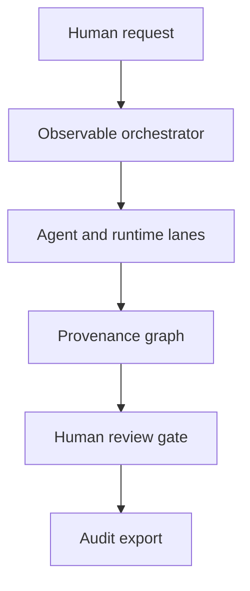

# Architecture

Project Glassbox is currently a dependency-free static web application and an executable reference design for AI-system observability. The demonstration runs entirely in the browser from `dist/`; it does not contact an AI provider or upload selected files.

## System boundary

The visual trace is constructed from explicit records—not inferred from private model state. The current demonstration supplies synthetic records and marks them as such. A real integration should emit the same contract from its orchestrator, tool broker, model gateway, policy engine, and sandbox runtime.

## Runtime components

| Component | Current implementation | Responsibility |
|---|---|---|
| Input panel | Static HTML and browser state | Captures a question, source URL, and attachment metadata |
| Trace store | In-memory JavaScript records | Holds context, events, agents, edges, telemetry, and reviews |
| Context Microscope | HTML, CSS, SVG, and JavaScript | Projects one trace into six inspection resolutions |
| Agent Layer | Architecture-aware agent records | Separates LLM, deterministic, and hybrid behavior |
| Provenance inspector | Click-driven record detail | Shows producer, source, context, transformation, relationships, gaps, and review |
| Timeline | Deterministic client playback | Pauses, steps, and replays the synthetic event sequence |
| WASM verifier | Embedded, import-free WebAssembly module | Replays a numeric calculation and compares module and output hashes |
| Human review ledger | In-memory browser state | Records approval, challenge, correction, or rejection against an item |
| Audit exporter | Browser JSON download | Serializes the visible trace, boundaries, deterministic replay, and reviews |
| Live adapter | `window.GlassboxAgentAdapter` | Validates and ingests observable events for registered demo agents |

## Agent architecture semantics

| Architecture | What Glassbox may show | What Glassbox must not claim |
|---|---|---|
| LLM-powered | Authorized context, model metadata, tool selection, emitted output, source-linked reasoning summary, uncertainty, and confidence | Private chain-of-thought or a literal translation of neural activity |
| Deterministic/WASM | Module identity, version, hash, inputs, branch or function, state transition, output, capabilities, timing, errors, and replay result | “Thinking,” judgment, or understanding |
| Hybrid | The LLM decision stage, deterministic execution stage, typed handoff, authority check, and responsibility for each operation | That deterministic verification proves the LLM interpretation or policy is correct |

## Six inspection resolutions

1. **System:** objective, participants, stage, and proposed direction.
2. **Agents:** identity, purpose, architecture, authority, task, lifecycle, dependencies, and contribution.
3. **Models:** provider-reported model or module version, context utilization, latency, and owner agent.
4. **Reasoning:** concise source-linked conclusions, assumptions, alternatives, uncertainty, and decision points.
5. **Evidence:** sources, excerpts, tool calls, transformations, conflicts, and provenance edges.
6. **Telemetry:** instrumented context counters, timing, retrieval activity, deterministic runtime data, and explicit instrumentation gaps.

These are views over the same record graph. Moving between them must not change the underlying claim or verification status.

## Observable control loop

1. A human supplies an objective and optional evidence.
2. An orchestrator emits bounded task and authority records.
3. Agents and runtime components emit context, messages, calls, transitions, outputs, and gaps.
4. Glassbox validates records and connects each derived item to its supporting records.
5. Conflicts and uncertainty remain visible during synthesis.
6. A consequential proposal stops at an explicit human-review boundary.
7. The exported audit bundle captures what was visible, unavailable, restricted, and reviewed.

## Current prototype constraints

- The included scenario, model names, providers, token utilization, latencies, evidence, and aggregate activation packet are synthetic.
- Entered public-source URLs are recorded but not fetched or authenticated.
- Selected files are represented by browser-visible metadata; their contents are not parsed or uploaded.
- Human reviews persist only for the current page session and audit export.
- The adapter accepts events only for agents already registered in the demonstration.
- Exported JSON is not yet signed or tamper-evident.
- Live model, retrieval, memory, tool, and neural telemetry require external instrumentation.

See [Integration](integration.md) for the current adapter and a production-oriented topology.
