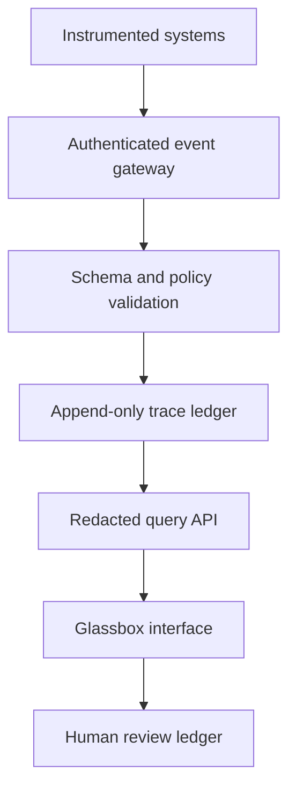

# Integration guide

The current prototype exposes a small browser-side adapter so a developer can replace or augment the synthetic stream with observable events. It is intentionally narrow: it accepts records only for the agents registered in the demonstration and does not create a secure server boundary.

## Current browser adapter

After `dist/app.js` initializes, the page exposes:

```js
window.GlassboxAgentAdapter.version;
window.GlassboxAgentAdapter.architectures;
window.GlassboxAgentAdapter.pause();
window.GlassboxAgentAdapter.ingest(record);
```

Example:

```js
window.GlassboxAgentAdapter.ingest({
  id: "live-evidence-001",
  agentId: "agent-evidence",
  step: 2,
  offset: 3.4,
  type: "tool-result",
  status: "observed",
  confidence: 96,
  title: "Read-only query completed",
  summary: "The approved query returned 48 matching records.",
  detail: "The broker recorded the query, row count, and result digest.",
  recordKind: "Observed tool result",
  context: "task=del-001; dataset=approved-service-log",
  source: "tool-broker/query-481",
  verification: "Result digest recorded; source accuracy not independently verified",
  transform: "Filtered by approved issue type and status",
  relationship: "Supports evidence item n2",
  excerpt: "rows=48; digest=sha256:…",
  unavailable: "Original record contents are restricted",
  basis: "Confidence reflects transport and digest integrity, not policy correctness.",
  history: ["Request authorized", "Query executed", "Result received"]
});
```

The canonical contract is [`schemas/observable-agent-event.schema.json`](../schemas/observable-agent-event.schema.json). Invalid identifiers, unknown agents, out-of-range steps, unsupported statuses, missing fields, or non-finite confidence values are rejected.

## Production-oriented topology



An implementation should instrument the orchestrator, model gateway, retrieval layer, tool broker, memory service, deterministic sandbox, policy gates, and human authorization service. The Glassbox UI should consume filtered trace records; it should not receive unrestricted production logs.

## Recommended event envelope

Wrap the observable record with transport and integrity metadata:

```json
{
  "specVersion": "1.0",
  "traceId": "trace_01J...",
  "eventId": "evt_01J...",
  "producer": {
    "id": "evidence-agent",
    "architecture": "llm",
    "runtimeVersion": "2026-09-01"
  },
  "observedAt": "2026-09-12T08:00:00Z",
  "classification": "internal",
  "previousDigest": "sha256:...",
  "contentDigest": "sha256:...",
  "payload": {}
}
```

Sign the canonical envelope at the trusted producer or gateway. Preserve receipt time separately from producer time. Never sign a human-readable summary in a way that implies its underlying claim was verified.

## Instrumentation by architecture

### LLM-powered agent

Capture the permitted instruction identities, redacted context manifest, retrieval records, model provider/name/version, context usage, tool requests, outputs, summary lineage, uncertainty, and explicit truncation or compaction. Do not capture or reconstruct private chain-of-thought.

### Deterministic or WASM agent

Capture the module or program identity, version, content hash, environment and capabilities, exact typed inputs, previous and next state, executed function or rule, selected branch, system access, timing or fuel when available, output, exit status, and replay result.

### Hybrid agent

Emit separate events for the LLM proposal, typed handoff contract, deterministic validation or execution, policy decision, and downstream result. Each event identifies which component proposed, transformed, authorized, or executed the operation.

## Data minimization

- Emit identifiers and digests instead of raw sensitive content where possible.
- Redact at the source boundary, not only in the browser.
- Record that redaction occurred, the policy used, and the fields withheld.
- Separate public, reviewer, operator, and security views.
- Apply retention and deletion rules to trace content, attachments, and review identities.

## Before a real integration is trusted

- Authenticate agents and tools.
- Validate records server-side against a versioned schema.
- Define clock, ordering, retry, duplication, and partial-trace semantics.
- Establish a confidence-calibration policy.
- Threat-model prompt injection, poisoned retrieval, log forgery, and review bypass.
- Add tamper-evident storage and export signatures.
- Test failure, redaction, truncation, and missing-instrumentation states.
- Perform an independent security and usability review.
